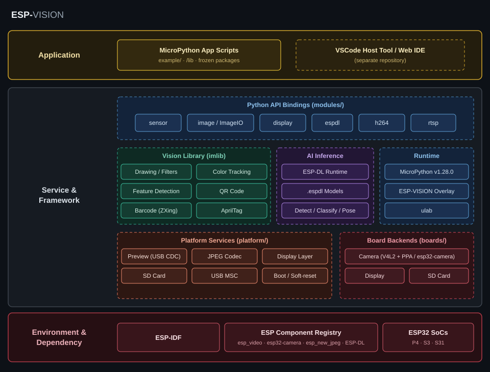

Solution Architecture
=====================

:link_to_translation:`zh_CN:[中文]`

ESP-VISION is organized around a MicroPython firmware build, board-specific hardware backends, shared platform services, and Python-facing vision modules. Code is layered by whether it touches MicroPython (``mp_obj_t`` / ``py/*.h``).

   ESP-VISION layered architecture overview

Layered Overview
----------------

.. blockdiag::

   blockdiag {
     orientation = portrait;
     default_group_color = none;

     scripts  [label = "MicroPython scripts\n(example/)"];
     bindings [label = "Bindings (modules/)\nsensor / image / display / espdl / tflite"];
     platform [label = "Platform services\n(platform/)"];
     imlib    [label = "imlib component\n(components/imlib)"];
     boards   [label = "Board backends\n(boards/<BOARD>)"];
     mp       [label = "MicroPython + overlay\n(build/, overlay/)"];

     scripts  -> bindings;
     bindings -> platform;
     bindings -> imlib;
     platform -> boards;
     boards   -> mp;
   }

- **Bindings** (``modules/``): the ``USER_C_MODULES`` layer. The main modules ``image``, ``sensor``, ``display``, ``espdl``, and ``tflite`` self-register via ``MP_REGISTER_MODULE``. ``py_imageio.c`` provides the ``image.ImageIO`` type, and ``py_helper.c`` is shared helper code. Bindings only do object conversion and light API adaptation; heavy logic lives in pure C or ``platform/``.
- **Platform services** (``platform/``): self-written ESP32 glue. ``ev_channel.c`` / ``ev_mux.c`` / ``ev_control_transport.c`` / ``ev_stdio.c`` (EV-MUX / EV-ATP transport), ``preview.c`` (EV-MUX JPEG preview), ``display.c`` (generic display layer), ``sdcard.c`` (mount at ``/sdcard``), ``usb_msc.c`` (exposes the ``ffat`` partition over TinyUSB MSC), ``jpeg.c`` (hardware or software JPEG), ``debug.c``, and ``main.c`` (startup init plus the soft-reset loop).
- **imlib component** (``components/imlib/``): pure-C vision algorithms, an IDF component maintained as MIT, derived from OpenMV ``lib/imlib``.
- **Board backends** (``boards/<BOARD>/``): per-board configuration and the real camera/display/sdcard implementations. P4X and S31 use ``esp_video``/V4L2; P4X also uses PPA, while S3 uses ``esp32-camera``.
- **MicroPython + overlay**: MicroPython v1.28.0 is the fixed baseline; project changes live in ``overlay/micropython/`` and are applied to a generated build copy under ``build/micropython/``.

Capture-to-Output Data Flow
---------------------------

.. blockdiag::

   blockdiag {
     orientation = portrait;

     sensor [label = "Camera sensor"];
     snap   [label = "sensor.snapshot()"];
     img    [label = "image.Image\n(reusable framebuffer)"];
     proc   [label = "imlib processing /\nAI inference"];
     lcd    [label = "display.write()\n-> LCD"];
     prev   [label = "img.flush()\n-> EV-MUX preview"];

     sensor -> snap -> img;
     img -> proc;
     img -> lcd;
     img -> prev;
   }

``sensor.snapshot()`` captures a frame into a reusable framebuffer wrapped as an ``image.Image``. Scripts then run ``imlib`` processing, ESP-DL inference, or TFLite Micro inference on the image, and send it to the LCD with ``display.write()`` or to the host preview with ``img.flush()``.

Low-Level Transport
-------------------

ESP-VISION host transport has three layers: physical sinks, routed streams, and EV-MUX logical channels.

Physical Sinks
~~~~~~~~~~~~~~

``platform/ev_channel.c`` defines the physical write targets:

.. list-table::
   :header-rows: 1
   :widths: 20 80

   * - sink
     - Meaning
   * - ``usj``
     - USB-Serial-JTAG. Available on boards that expose this peripheral; it is the preferred fallback when no host holds USB-OTG CDC open.
   * - ``cdc``
     - USB-OTG CDC. When available, opening the port (DTR) makes it the automatic route for every stream. It also provides MSC file preview.
   * - ``uart``
     - Wired auxiliary sink for runtime redirection (``route.bind`` / ``route.auto``); never selected automatically. A stream bound to UART accepts its framed ingress there as well.
   * - ``console``
     - MicroPython stdout fallback.
   * - ``null``
     - Drops output; ``none`` is an alias.

``cdc`` reports two states: ``present`` means the USB-OTG interface is enumerated; ``ready`` means a host holds the port open (DTR asserted). ``ready`` alone decides routing — there is no activation RPC, lease, or heartbeat anywhere in the design.

Routed Streams
~~~~~~~~~~~~~~

``ev_stream_t`` is the physical routing abstraction. There are fewer streams than EV-MUX channels. A route applies to a complete stream, not to one logical channel: once a stream is bound to a sink, every channel assigned to that stream uses that sink. Device-to-host frames are written to it, and host-to-device frames for those channels are accepted only from it.

One rule decides the automatic route of every stream: **the active sink is ``cdc`` while a host holds the USB-OTG port open (DTR), otherwise it is the board's preferred fallback (USJ when available, then the console fallback).** A dedicated transport task watches the DTR edge and applies it to both streams; ``route.changed`` (reason ``cdc_connected`` / ``cdc_disconnected``) is emitted per stream on every transition. Host disconnect or crash drops DTR, so the fallback is automatic — no keepalive is required.

.. list-table::
   :header-rows: 1
   :widths: 24 38 38

   * - stream
     - Carries
     - Routing policy
   * - ``EV_STREAM_USER``
     - Normal work plane: ``user.rpc``, ``repl.stdin``, ``repl.signal``, ``repl.stdout``, ``repl.stderr``, and ``preview.frame``
     - Follows the active sink (DTR rule above).
   * - ``EV_STREAM_DEBUG``
     - Debug and system traffic: ``debug.rpc`` / ``log.idf``
     - Follows the active sink, so the connected USB port carries every logic channel.

``route.bind`` pins one stream to a fixed sink (runtime redirection, e.g. ``debug`` to ``uart`` for a wired log tap); a manually bound stream leaves the DTR rule until ``route.auto`` restores it.

EV-MUX Channels
~~~~~~~~~~~~~~~

EV-MUX channels describe end-to-end protocol semantics; they are not physical ports. Each channel is assigned to exactly one stream, and a host must not select a sink independently for an individual channel. ``direction`` describes frame direction. Device-to-host frames use the current sink of their stream; host-to-device frames are authorized against the current sink of their stream.

.. list-table::
   :header-rows: 1
   :widths: 22 20 22 24 34

   * - channel
     - direction
     - assigned stream
     - payload type
     - Purpose
   * - ``user.rpc``
     - bidirectional
     - ``user`` (``rsp`` / ``event``)
     - JSON
     - Normal host work control such as ``hello``, ``capabilities``, ``script.write``, ``script.run``, and ``device.control``.
   * - ``debug.rpc``
     - bidirectional
     - ``debug`` (``rsp`` / ``event``)
     - JSON; ``debug.capture_frame`` answers with a binary JPEG payload inside the response frame itself
     - System/debug EV-ATP requests, responses, events, and errors. ``req`` is Host -> Device; ``rsp`` / ``event`` are Device -> Host.
   * - ``repl.stdin``
     - Host -> Device
     - ``user``
     - text
     - Host input to the REPL; not an output stream.
   * - ``repl.signal``
     - Host -> Device
     - ``user``
     - small binary/text
     - Host signals such as Ctrl-C.
   * - ``repl.stdout``
     - Device -> Host
     - ``user``
     - text
     - Python ``print()``, REPL prompts, and C stdout.
   * - ``repl.stderr``
     - Device -> Host
     - ``user``
     - text
     - Python exceptions and C stderr.
   * - ``log.idf``
     - Device -> Host
     - ``debug``
     - text
     - ESP-IDF ``ESP_LOGx`` output.
   * - ``preview.frame``
     - Device -> Host
     - ``user``
     - binary JPEG
     - Preview frames produced continuously by ``img.flush()``; no subscription is needed and no RPC is involved.

EV-MUX Frame Format
~~~~~~~~~~~~~~~~~~~

All EV-MUX frames are length-prefixed, and payloads may be binary:

.. code-block:: text

   \x1eEVMUX/1 h=<metadata_len> p=<payload_len> c=<crc32>\r\n
   <metadata JSON bytes>
   <payload bytes>
   \x1f

``h`` and ``p`` are authoritative lengths; ``0x1f`` is only an EOF guard and resynchronization aid. Firmware-generated frames include a payload CRC32. Host-to-device command frames may use ``c=00000000``; the firmware receiver treats zero as "skip CRC validation".

EV-ATP Control
~~~~~~~~~~~~~~

EV-ATP RPC is split by semantics:

- ``user.rpc`` carries normal IDE operation: ``hello``, ``capabilities``, ``script.write``, ``script.run``, and ``device.control``.
- ``debug.rpc`` carries system/debug commands: ``transport.state``, ``route.get``, ``route.bind``, ``route.auto``, ``debug.info``, and ``debug.capture_frame``. Responses return to the sink the request arrived on. ``debug.capture_frame`` returns its image as the binary payload of the ``debug.rpc`` response frame (``contentType=image/jpeg`` plus ``width`` / ``height`` in metadata); there is no separate data channel.

``route.changed`` is a routing event on ``user.rpc`` / ``user``; it is not a ``debug.rpc`` event. It reports a stream-level sink change (reason ``cdc_connected`` / ``cdc_disconnected``), so the host must update the connection state of every channel assigned to that stream.

Routing itself needs no RPC: opening the USB-OTG port makes it the active sink, and closing it selects the board's fallback. There is intentionally no activation, lease, or heartbeat method — the wire state (DTR) is the whole routing protocol.

Host Integration Contract
~~~~~~~~~~~~~~~~~~~~~~~~~

The host uses exactly one physical USB connection at a time. On dual-USB boards, USB-OTG and USJ are equivalent choices and either one carries every channel. The connection sequence is:

#. Open the chosen port. EV-MUX is enabled at boot, so no REPL access is required: the device emits a bootstrap ``hello`` event when a USB link appears (and again after every soft reset).
#. Send a framed ``hello`` request (or consume the boot event), then request ``capabilities``. Verify that ``firmware.id`` is ``esp-vision``, check ``evMuxVersion``, and negotiate the advertised features/channels.
#. Use the device: REPL channels, ``script.write`` / ``script.run``, preview, ``debug.rpc``, and ``log.idf`` are all live on the opened port. No activation step and no heartbeat exist; the port is the route.
#. On disconnect just close the port. If USB-OTG closes (or the cable drops), all streams select the board's fallback automatically and a ``route.changed`` event reports it.

``sensor.evmux()`` remains as a debug toggle (for example to recover a plain text REPL with ``sensor.evmux(False)``); boards can opt out of boot-time enablement by defining ``ESP_VISION_EV_MUX_DEFAULT_ENABLED`` to ``0`` in ``boardconfig.h``.

The ``hello``, ``capabilities``, and ``debug.info`` device payloads all contain the same ``firmware`` object. Its stable ``id`` is ``esp-vision``. Its ``version`` is the ESP-IDF ``PROJECT_VER`` derived from Git: an official release build reports its ``YYYY.MM.DD`` tag, while an untagged development build includes the ``-N-g<commit>`` suffix (and may include ``-dirty``). Hosts may display or compare this build identity for update UX, but protocol compatibility must be decided from ``evMuxVersion`` and advertised capabilities rather than the release string.

The host demultiplexer must inspect ``metadata.channel`` on every frame and dispatch by channel. It must not infer frame type from the port or a preceding frame. A host should maintain a static ``channel -> stream`` table and a dynamic ``stream -> sink`` table; route changes update only the latter.

Receive-Side Demultiplexing
~~~~~~~~~~~~~~~~~~~~~~~~~~~

The firmware receiver keeps state only for byte-stream frame assembly. Once a complete EV-MUX frame arrives, its assigned stream is first validated against the actual ingress sink, then it is dispatched immediately by ``metadata.channel`` / ``type`` / ``method``:

- ``repl.stdin`` is queued into the REPL input ring buffer.
- ``repl.signal`` schedules signals such as keyboard interrupt.
- ``user.rpc`` / ``debug.rpc`` first select the RPC domain, then execute EV-ATP control logic by ``method``.

Ingress authorization is a single whitelist: the discovery methods ``hello`` / ``capabilities`` are accepted on either USB sink; every other channel is accepted only from the current route of its assigned stream. This also permits framed control on UART after an explicit ``route.bind``. Business logic must not infer frame type from a "current mode".

Transport Execution Model
~~~~~~~~~~~~~~~~~~~~~~~~~

EV-MUX is enabled at boot by default (``ESP_VISION_EV_MUX_DEFAULT_ENABLED``), so the control plane is always discoverable without REPL access; after every soft reset the mux state and routes return to the same deterministic defaults.

Frame reception does not depend on the REPL. A dedicated transport task (``ev_transport``, see ``platform/ev_control_transport.c``) owns the receive path: it pumps the TinyUSB device stack, drains the USJ/CDC/UART ingress ring buffers into the per-ingress frame parsers, dispatches complete frames, and applies the DTR routing rule (active sink switch and ``route.changed`` emission). ``mp_hal_stdin_rx_chr()`` no longer parses frames; when EV-MUX is enabled it only consumes framed ``repl.stdin`` bytes.

Dispatch is split by execution context:

- Transport-task RPCs (answered immediately, even while user code runs): ``hello``, ``capabilities``, ``transport.state``, ``route.*``, and ``device.control``. ``repl.signal`` schedules the keyboard interrupt from the transport task, so host Ctrl-C reaches a running script.
- VM-task RPCs (queued to the interpreter and executed from ``mp_hal_stdin_rx_chr()`` context): ``script.write``, ``script.run``, ``debug.info``, and ``debug.capture_frame`` — anything touching MicroPython objects, the VFS, or the camera. A full queue is answered with a ``VM_BUSY`` error.
- ``repl.stdin`` payloads are queued into the framed REPL input ring and consumed by the REPL loop.

While EV-MUX is enabled, every physical byte stream carries frames only: the low-level USJ/CDC/UART receive paths do not interpret ``0x03`` as Ctrl-C (interrupt semantics belong to the framed ``repl.signal`` channel), and unframed bytes are discarded by the frame parser's SOF resynchronization.

Known Transport Issues
~~~~~~~~~~~~~~~~~~~~~~

The following USB transport issues are known and tracked separately from the normal EV-MUX / EV-ATP routing contract:

- USB MSC currently exposes the ``ffat`` / ``vfs`` partition directly through TinyUSB callbacks. MSC writes are not coordinated with the MicroPython VFS or IDE file writes, so concurrent host MSC access and script/file operations can corrupt the filesystem. Until write coordination is implemented, MSC should be treated as read-only or mutually exclusive with IDE file writes.

Implementation notes (observability retained):

- Frame writes use a bounded write-all loop with progress detection and an explicit timeout (``platform/ev_mux.c``); the low-level sinks report their real written byte counts, so a partial write aborts the frame deterministically and is counted, instead of silently truncating it.
- Preview frames are the single lossy class. A stalled sink is marked congested for a short cooldown; while congested, ``preview.frame`` frames are dropped whole before a single byte is written (``ev_mux_write_lossy``), so the byte stream on the wire always stays parseable. On the USJ route the producer additionally caps the preview rate (one frame per 100 ms) because USB-Serial-JTAG throughput is far below OTG CDC. RPC and REPL frames are never dropped by this mechanism.
- All three ingress ring buffers are 2048 bytes. ``debug.info`` scope ``transport.stats`` (pure C, answered even while the VM is busy) reports per-ingress RX byte counts and ring-full events, complete/malformed/rejected frame counters, and replRx/VM_BUSY/TX write-timeout/TX congestion-drop counters (``txDrop``). replRx overflow is currently counted only; there is no dedicated host overflow event yet.

Source Tree
-----------

.. list-table::
   :header-rows: 1
   :widths: 25 75

   * - Path
     - Responsibility
   * - ``idf_ext.py``
     - Board-aware ``idf.py`` extension for the repository root.
   * - ``micropython.cmake``
     - Integration hub: registers user modules, platform and board sources, include paths, conditional ``zxing``, and ``ulab``.
   * - ``lib/``
     - Pinned third-party submodules (MicroPython, ``ulab``, ZXing-C++).
   * - ``overlay/micropython/``
     - ESP-VISION MicroPython delta, using the MicroPython path layout.
   * - ``boards/``
     - Per-board config, frozen manifests, and board peripheral backends.
   * - ``platform/``
     - Shared runtime services (camera, preview, storage, display, USB, JPEG).
   * - ``modules/``
     - MicroPython C/C++ bindings (``sensor``, ``image``, ``display``, ``imageio``, ``espdl``, ``tflite``, plus chip-dependent ``h264`` and ``rtsp``).
   * - ``components/``
     - ESP-IDF components, including OpenMV ``imlib`` and the ZXing backend.
   * - ``models/``
     - Optional model assets loaded from board storage at runtime.
   * - ``example/``
     - MicroPython example scripts.
   * - ``stubs/``
     - ``.pyi`` type stubs describing the C modules.

Board Composition
-----------------

A board is defined in a single tree, ``boards/<BOARD>/``:

- ESP-VISION side (top level): ``boardconfig.h``, ``imlib_config.h``, ``manifest.py``, and optional ``camera.c`` / ``display.c`` / ``sdcard.c``.
- MicroPython port side (``boards/<BOARD>/port/``): ``IDF_TARGET`` value, sdkconfig, partitions, and USB strings. The build projects this subdirectory onto ``ports/esp32/boards/<BOARD>/`` of the generated MicroPython copy.

See :doc:`../how-to/add-board` for the step-by-step procedure.

Chip-Dependent Sources
----------------------

``micropython.cmake`` selects modules from ``IDF_TARGET`` and the board profile. The ESP32-P4 build includes ``h264`` and ``rtsp``; the current P4 board profiles also enable the ZXing-C++ barcode backend. See :doc:`../target-support/index` for the resulting public API matrix.

MicroPython Overlay
-------------------

ESP-VISION uses MicroPython v1.28.0 as a fixed upstream baseline. Project changes to the ESP32 port live under ``overlay/micropython/``. The ``prepare-micropython`` build step applies that tree to a generated copy under ``build/micropython/idf<ESP_IDF_VERSION>/micropython/``; the ``lib/micropython`` submodule remains a clean upstream reference.

For how ESP-VISION relates to its upstream projects, see :doc:`../project-relationship/index`; for the license of each component, see :doc:`../license/index`.
